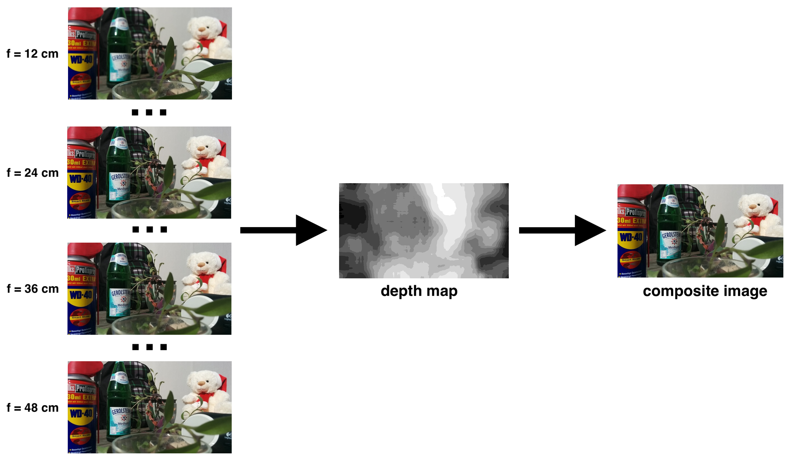

# Depth from Focus
Thought experiments around extracting depth maps from image sequences.

# Method 1: Signal Processing Method
Given a sequence of images and groundtruth focal distances for each image:

```pseudocode
1. For each input image i:
  a. For each x,y coordinate in image i:
    i. Let p = the pixel value at i(x,y)
    ii. Let p_contrast = the contrast measurement of p
2. Let disparity_map = argmax(focal distance for each p_contrast(i,x,y))
3. Apply a smoothing function to extract surfaces from disparity_map
4. Let reconstructed_image = original RGB pixel value corresponding to disparity_map distances
```

This method is pleasingly parallel and surprisingly effective, even with uncalibrated images (i.e. no camera intrinsics are known).

Obviously this system can fail with smooth, featureless surfaces such as blank walls.



Above: Example workflow for the `balcony` dataset. Note that in the `depth map` black pixels indicate _near_ distance and white pixels indicate _far_ distance.

# Future Work

- [ ] Experiment with more robust measures for extracting surfaces in the disparity map
- [ ] Extract hyperparameters with training data to make the system more robust to rugose surfaces (e.g. brick walls) 
- [ ] Experiment with convolutional neural network (CNN) approaches
